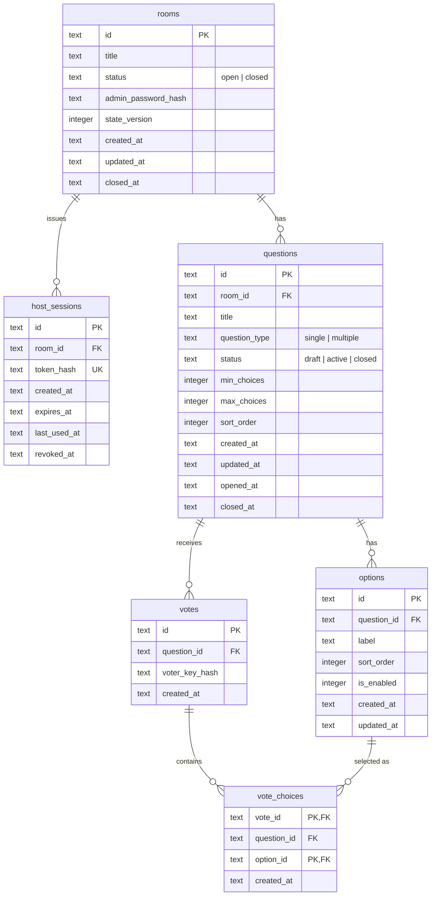

# ER図

D1に保存する永続データの関係です。Durable Objectは投票データを永続化せず、D1から生成されたsnapshotを一時的に保持します。

## 主な制約

| テーブル | 制約 | 目的 |
| --- | --- | --- |
| `rooms` | `status` と `closed_at` の整合性 | `open` は `closed_at` なし、`closed` は `closed_at` ありにする |
| `host_sessions` | `UNIQUE(token_hash)` | ホストセッショントークンの重複防止 |
| `questions` | `UNIQUE(room_id, sort_order)` | ルーム内の質問表示順を一意にする |
| `options` | `UNIQUE(question_id, sort_order)` | 質問内の選択肢表示順を一意にする |
| `options` | `UNIQUE(question_id, id)` | `vote_choices` から「質問に属する選択肢」を参照する |
| `votes` | `UNIQUE(question_id, voter_key_hash)` | 同じ匿名セッションから同一質問への重複投票を防ぐ |
| `votes` | `UNIQUE(id, question_id)` | `vote_choices` から「質問に属する投票」を参照する |
| `vote_choices` | `PRIMARY KEY(vote_id, option_id)` | 1回の投票内で同じ選択肢を重複保存しない |

## 削除方針

- `rooms` を削除すると、`host_sessions`、`questions`、`options`、`votes`、`vote_choices` は `ON DELETE CASCADE` で削除されます。
- 終了済みルームは `closed_at` から30日間保持し、日次Cronで削除します。
