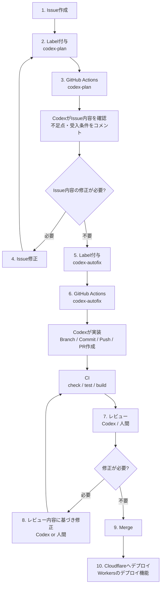

# 開発フロー図

Issue作成からCodexによる要件整理、実装PR、レビュー、Cloudflare Workersへのデプロイまでの流れです。

## トリガー

| 操作 | 実行されるworkflow | 役割 |
| --- | --- | --- |
| Issueに `codex-plan` ラベルを付与 | `.github/workflows/codex-plan.yaml` | Issueの要件、受入条件、不足点を整理してコメント |
| Issueに `codex-autofix` ラベルを付与 | `.github/workflows/codex-autofix.yaml` | Issue内容に基づいて実装し、PRを作成 |
| PR作成・push | `.github/workflows/ci.yaml` | `pnpm check`、`pnpm test`、`pnpm build` を実行 |

## 補足

- `codex-plan` の結果に不足点がある場合はIssue本文を修正し、再度 `codex-plan` を実行します。
- `codex-autofix` はIssue内容をもとにBranch作成、実装、Commit、Push、PR作成を行います。
- レビュー後の修正はCodexでも人間でも行えます。
- Merge後のデプロイはCloudflare Workersのデプロイ機能で行います。
