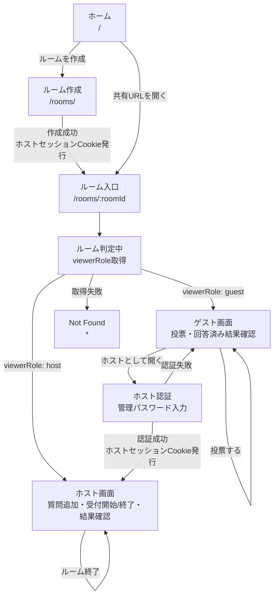

# 画面遷移図

TOHYO通信の主要画面と遷移です。`/rooms/:roomId` はホスト/ゲスト共通入口で、WorkerがホストセッションCookieを検証して表示を切り替えます。

## 画面

| 画面 | ルート | 役割 |
| --- | --- | --- |
| ホーム | `/` | アプリ概要とルーム作成への導線 |
| ルーム作成 | `/rooms/` | ルーム名、管理パスワード、Turnstileを入力してルームを作成 |
| ルーム入口 | `/rooms/:roomId` | `viewerRole` を取得し、ホスト画面またはゲスト画面へ分岐 |
| ホスト画面 | `/rooms/:roomId` | 質問追加、受付開始・終了、全結果確認、ルーム終了 |
| ゲスト画面 | `/rooms/:roomId` | 受付中質問への投票、回答済み質問の結果確認、ホスト認証 |
| Not Found | `*` | 未定義ルートまたはルーム取得失敗時の表示 |

## 補足

- ホスト画面とゲスト画面は同じURLを使います。
- `viewerRole` は表示分岐用です。ホスト専用APIはサーバー側でホストセッションCookieを再検証します。
- ゲスト画面から管理パスワード認証に成功すると、同じURLのままホスト画面へ切り替わります。
