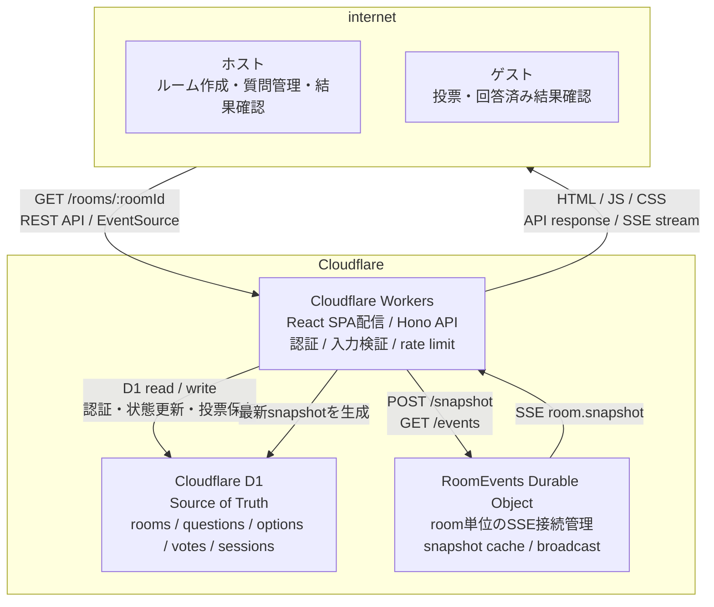

# システム構成図

TOHYO通信のCloudflare環境内の主要コンポーネントと、ホスト・ゲストから見た通信経路です。

## 役割

| コンポーネント | 役割 |
| --- | --- |
| ホスト | ルーム作成、質問追加、受付開始・終了、全結果の確認 |
| ゲスト | 受付中の質問への投票、回答済み質問の結果確認 |
| Cloudflare Workers | React SPAの静的ファイル配信、APIルーティング、認証、入力検証、rate limit、D1操作、SSE入口 |
| Durable Objects | ルーム単位のSSE接続管理、最新snapshotのインメモリキャッシュ、broadcast |
| D1 | ルーム、質問、選択肢、投票、セッションを保持する唯一の永続データストア |

## 境界

- D1が投票データのSource of Truthです。
- Durable ObjectはD1へ直接アクセスせず、WorkerがD1から生成したsnapshotだけを受け取ります。
- ホスト/ゲストの表示切り替えは、WorkerがホストセッションCookieを検証して返す `viewerRole` に従います。
- ホスト専用APIは、表示上の `viewerRole` ではなく、サーバー側のホストセッションCookie検証で保護します。
