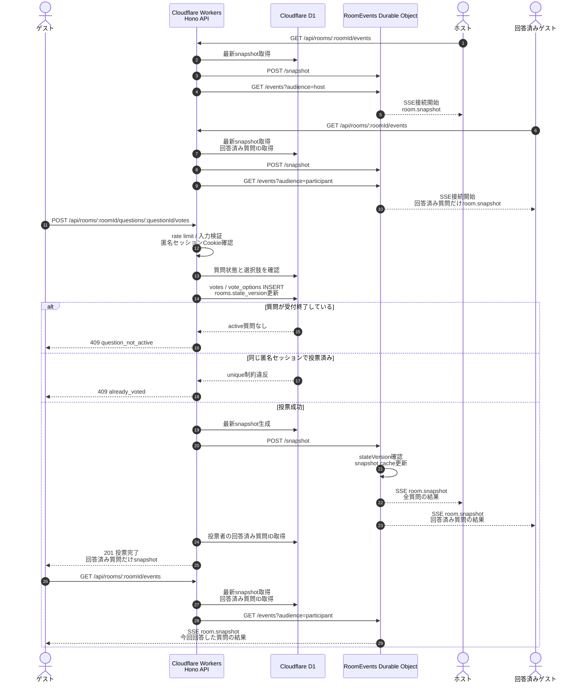

# 投票・リアルタイム更新シーケンス図

ゲストが投票してから、D1更新、snapshot生成、Durable Object経由のSSE配信までの流れです。

## 補足

- 投票データの永続化と重複投票チェックはD1で行います。
- `rooms.state_version` を更新し、D1から作った絶対値のsnapshotをDurable Objectへ渡します。
- Durable ObjectはD1へ直接アクセスせず、受け取ったsnapshotを接続中クライアントへ配信します。
- ホストには全質問の結果を配信し、ゲストには回答済み質問の結果だけを配信します。
- ゲストは投票成功後、今回回答した質問の結果を受け取るためにSSE接続を張り直します。
